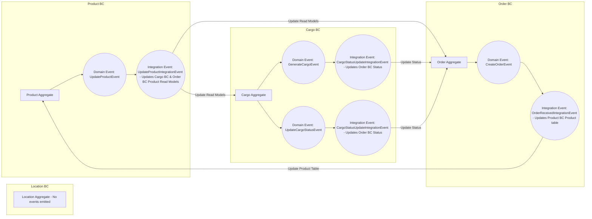

# Cargo.DomainDriven.Sample

Bu proje Domain Driven Design (DDD) prensipleriyle geliştirilmiş bir kargo yönetim örneğidir.

## Domain Driven Design - Bounded Context Diagram

## Event Yönetimi ve Veri Tutarlılığı
- Bounded Context içerisindeki domainler arası iletişim Domain Event ile sağlanır.
- Bounded Context’ler arasındaki iletişim ise Integration Event mekanizmasıyla gerçekleştirilir.
- Audit (denetim) için, temel event sınıfına ShouldLogEvent özelliği eklenmiştir.
  - Bu özellik true olduğunda event, EventStore'a yazılır ve böylece audit altyapısı oluşturulur.
- Integration Eventler, iletişim ve mesajlaşma yönetimi için MassTransit kütüphanesi ile yönetilmektedir.
- Domain Eventler ise, uygulama içi işlem ve koordinasyon için MediatR yapısı kullanılarak yönetilir.
- Aggregatelar sadece kendi verilerini tutacak şekilde tasarlanmıştır.
  - Bu amaçla, Bounded Context’ler arası veri tutarlılığını sağlamak için Read Modeller oluşturulmuştur.
  - Böylece, aggregatelar sadece kendi sorumluluk alanlarındaki verilerle ilgilenir ve karmaşıklık azaltılır.

